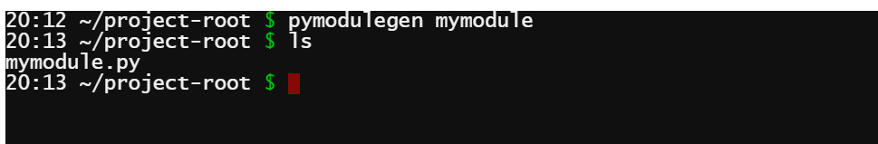
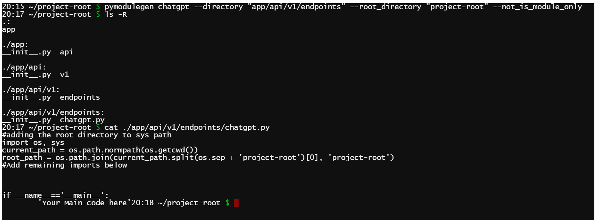
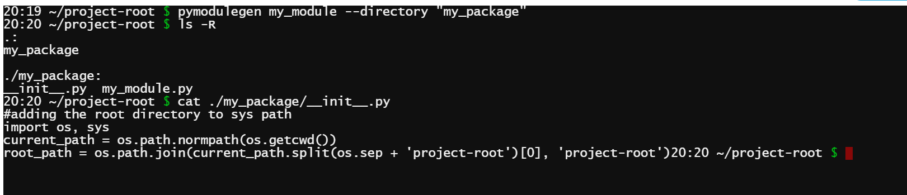

# pymodulegen

[](https://example.com/build)
[](https://github.com/YashNarK/pymodulegen/releases)
[](LICENSE)

## Table of Contents
- [Installation](#installation)
- [Usage](#usage)
- [Contributing](#contributing)
- [License](#license)
- [Acknowledgements](#acknowledgments)
- [Contact](#contact)
- [Examples and Screenshots](#examples-and-screenshots)


## Description

pymodulegen is a project aimed to generate python modules and packages, and add root directory of the project in sys path to allow importing parent modules in child using absolute paths relative to root directory.

## Installation

### Using pip
   ```bash
   pip install pymodulegen
   ```
### Clone from source
   ```bash
   git clone https://github.com/YashNarK/pymodulegen.git
   ```


## Usage
To generate a module or package and set root directory, use the following command:

```bash
pymodulegen module_name [--options]
```

Options:
- `module_name`: The name of the module to generate.
- `--directory`: (Optional) The directory where the module should be created.
- `--root_directory`: (Optional) The root directory for sys.path.
- `--is_module_only`: (Optional) Specify if the module should be used as a module only.
- `--not_is_module_only`: (Optional) Specify if the module should be used as a main program as well

## Contributing

Contributions are welcome! Please follow these guidelines:

1. Create an issue to discuss major changes or enhancements.
2. Fork the repository and create a new branch for your contribution.
3. Submit a pull request with a clear description of your changes.
4. Follow coding standards and maintain code quality.

## License

This project is licensed under the [MIT License](LICENSE).

## Acknowledgments

I would like to acknowledge the following resources that were helpful during the development of this project:

- [GeeksforGeeks - Python Import from Parent Directory](https://www.geeksforgeeks.org/python-import-from-parent-directory/): This tutorial provided valuable insights into importing modules from parent directories in Python. It was a useful reference while working on this project.


## Contact

- Email: narenkrithick@gmail.com
- GitHub: [YashNarK](https://github.com/YashNarK)

## Examples and Screenshots

### Example 1

[](images/screenshot1.png)

Generate a module named "mymodule" in the current directory (default settings).

### Example 2

[](images/screenshot2.png)

Generate a module named "chatgpt" in the "app/api/v1/endpoints" directory with root directory "project-root" and use it as a main program as well.

### Example 3

[](images/screenshot3.png)

Generate a package (with __init__.py) named "my_package" in the current directory (default settings) with a module my_module.

